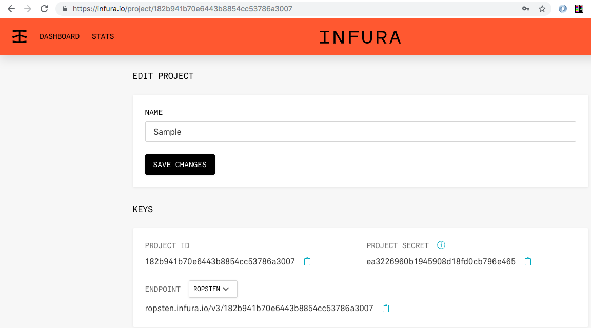
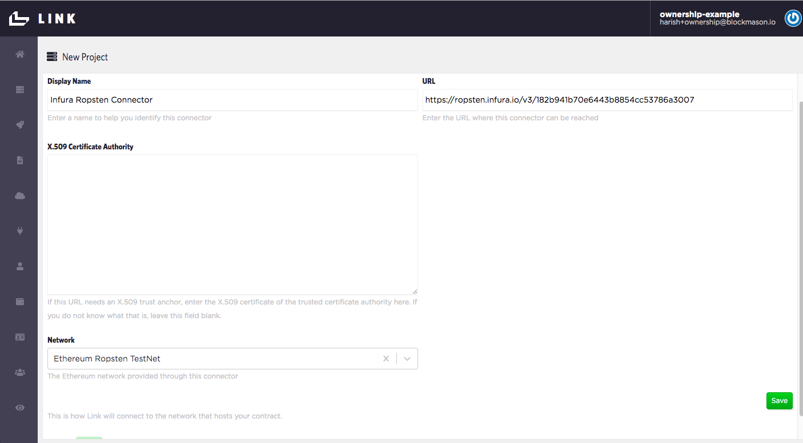
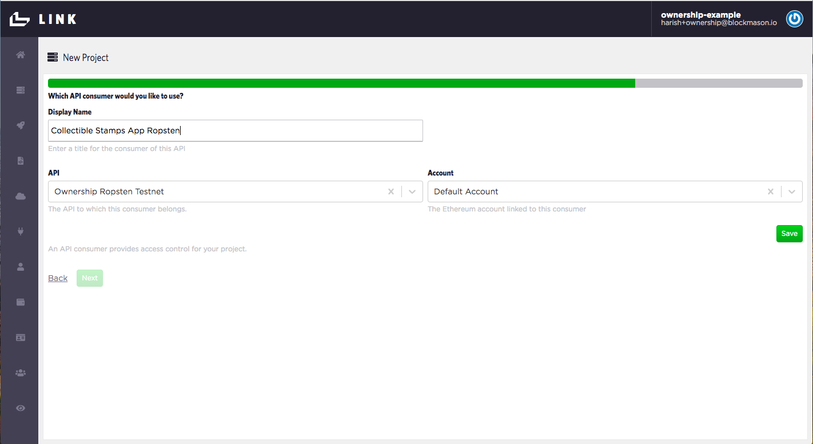
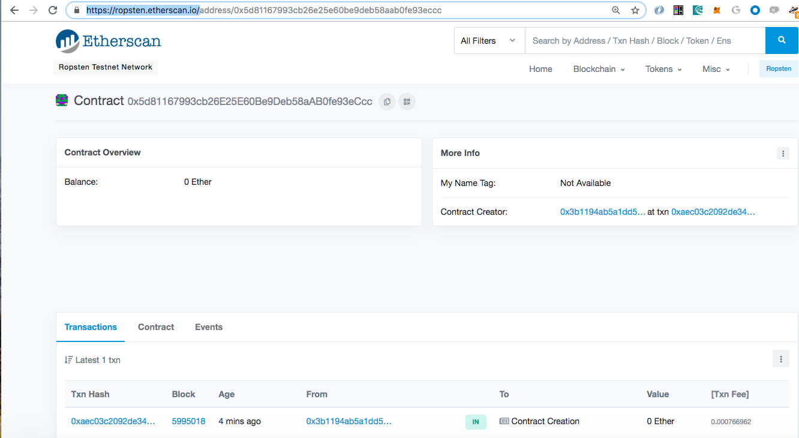
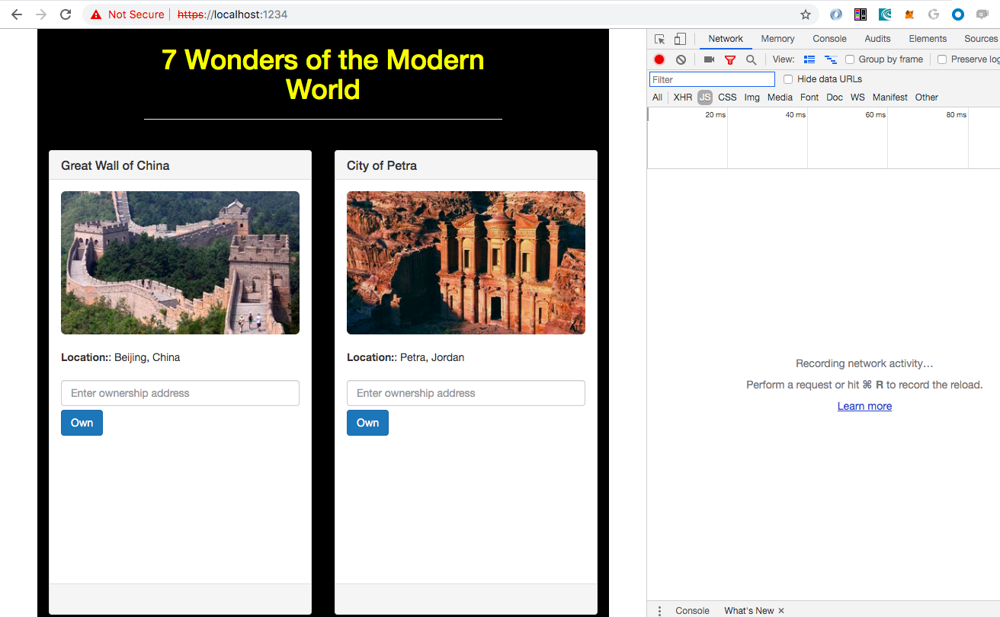
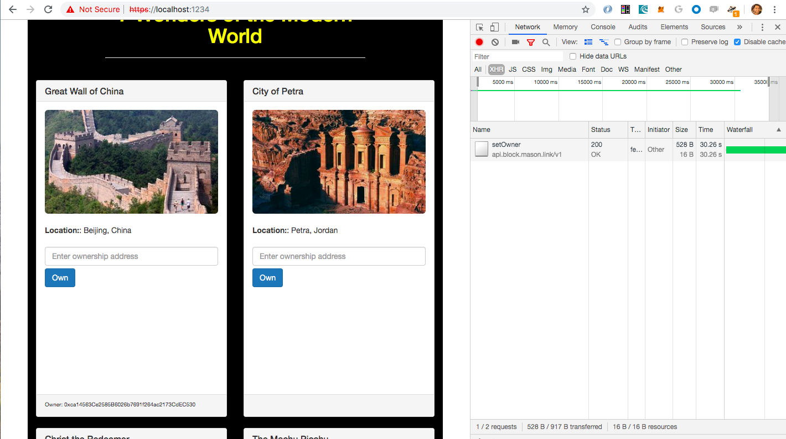
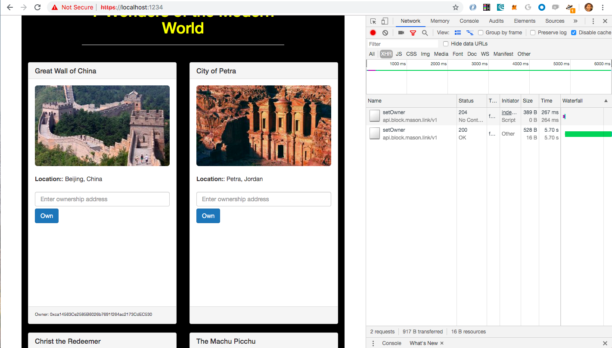

# Ownership DApp Demo comparing GoChain and Ethereum (Part 2)

Blockmason is excited to announce the integration of GoChain into its functions-as-a-service (FaaS) product [Link](https://mason.link). Link allows developers to use smart contracts and the power of blockchain in their web or mobile applications with *very little to no prior blockchain experience.* Link creates classic, conventional, web-based APIs for any smart contract written on a programmable blockchain such as GoChain.

[GoChain](https://gochain.io) is a scalable, high performance and low cost blockchain that supports smart contracts and distributed applications. GoChain is fully compatible with existing Ethereum wallets, smart contracts and tools and boasts significantly faster transactions (1300 tps) and lower fees (7500x cheaper) than Ethereum. 

In this activity, we will use Link to record ownership of assets (in this example, collectible digital stamps) on the Ethereum Testnet and then compare performance between GoChain and Ethereu.

**Note:** Part 1 of this activity can be found here: 

A simple front-end template is provided and [Parcel](https://parceljs.org/) will be used as the web application bundler and server.

The key steps of this activity are:
1. Fund your Ethereum account with test ETH tokens
2. Deploy the Ownership smart contract to the Ethereum Ropsten Testnet using Link
3. Configure a front-end JavaScript file
4. Run your decentralized application (DApp) on Ethereum Testnet
5. Compare performance between GoChain and Ethereum Testnets

### Fund your Link account with test ETH

Similar to Part 1 where we acquired test GO, we need to acquire test ETH to pay for gas transaction costs on the Ethereum blockchain.

> Log into Link and copy your default Link Ethereum account as shown:


> Go to the Ropsten Ethereum Faucet at https://faucet.ropsten.be/, paste in your Link Ethereum account address and click `Send me test Ether`. 


You can confirm receipt of your test ETH by searching your Link account address using the Ropsten Etherscan at https://ropsten.etherscan.io. 

### Setup Infura

> If you haven't done so already, create an account on Infura, which provides easy-to-use APIs to interact with the Ethereum network without running your own Ethereum node. Register for an API key at https://infura.io/register and then create a project. You will then be able to access URLs containing your API key for the Ethereum Mainnet and all Testnets.



### Deploy the Ownership Smart Contract
The `Ownership.sol` file in the `simple-ownership-contract-demo` repo contains a very simple Ownership Smart Contract programmed using Solidity (supported by both GoChain and Ethereum):
```
pragma solidity ^0.5.8;

contract Ownership {
    mapping(string => address) public ownerOf;
    address public authority;
    
    constructor() public {
        authority = msg.sender;
    }
    
    function setOwner(string memory asset, address owner) public {
        ownerOf[asset] = owner;
    }
}
```
* Ownership is recorded in a mapping called `ownerOf` between an asset name (some string) and an Ethereum wallet address.
  
* Using the keyword `public` for the `ownerOf` mapping object automatically provides us with a getter for that object.

* The `authority` in this case will be a Link managed Ethereum address.

The following steps are similar to those used in Part 1 to deploy to the GoChain Testnet:

> 1. In Link, open up the setting dropdown menu and select *`New Project`* which starts the new project wizard.


> 2. Under *Which contract would you like to use?*, select `Ownership` which we created in Part 1.

> 3. Under *Which Ethereum account would you like to use?*, use the *`Default Account`*. This is the account we seeded earlier with test ETH. 


> 4. Under *Which network would you like to use?*, select *`Create new`* and call it `Ethereum Ropsten Testnet`. Keep the *Block Confirmations Needed* at 0. Press *`Save`* and *`Next`*.

> 5. Under *Which connector would you like to use?*, select *`Create new`*. Call this connector `Infura Ropsten Connector` and use the URL for the Ropsten network from Infura (e.g. https://ropsten.infura.io/v3/182b941b70e6443b8854cc53786a3007). Ensure the *Network* selected is *`Ethereum Ropsten Testnet`*. Press *`Save`* and *`Next`*.



> 6. Now we just need to label our Deployment. Under *Where is your contract deployed?*, select *`Create new`*. Call this deployment `Ownership Ropsten Testnet Deployment`. Since we do not have **an existing contract deployment on Ethereum**, leave the *Address* field blank. Ensure the *Account* is the `Default Account`, the *Contract* is the `Ownership` contract and the *Network* `Ethereum Ropsten Testnet`. Press *`Save`* and *`Next`*.


> 7. Now we're ready to deploy our contract to the Ethereum Ropsten Testnet. Press `Deploy` and you should get a deployment in progress indicator icon. This might take a few seconds to complete. If deployed correctly, you'll proceed to the next step to setup your API.


> 8. Now we label our Ownership contract API. Under *Name*, call it *`ownership-ropsten-testnet`* Also add in a human-readable display name. Ensure you are using the correct *Contract Deployment*. Press *`Save`* and *`Next`*.

> 9. Now we label our Ownership API **Consumer**. This would normally be the name of the app or service calling the API. For this activity, the consumer is a `Collectible Stamps App Ropsten`. Ensure you are using the correct *API* and *Account*. Press *`Save`* and *`Next`*.



> 10. Lastly, your consumer needs to authenticate with the Ownership API. A OAuth2.0 Client Secret is automatically generated. Ensure you are using the correct Principal/Consumer. Press *`Save`*, *`Next`* and then *`Finish`*.


Once you hit *`Finish`*, you should see your Ownership API documentation. Note the `client_id` and `client_secret` under *Authentication* which we will be using in our front-end app. 


Let's also check that our Ownership contract deployed correctly on the Ethereum Ropsten Testnet. Click on the `Ethereum Contract Deployments` menu item to see a list of contract deployments and their addresses. Copy and paste the address of the `Ownership Ropsten Testnet Deployment` into the Ropsten Testnet explorer https://ropsten.etherscan.io to see the details of your contract deployment.


In the above example, the contract address on Ropsten Testnet is `0x5d81167993cb26e25e60be9deb58aab0fe93eccc`.



And we see our contract deployed on the Ropsten Testnet!

### Comparing GoChain and Ethereum network performance

We can easily compare performance between the GoChain and Ethereum test networks for which we have created APIs (and their corresponding consumers) in Link by simply using the appropriate credentials for the API we want to use. 

> In Link, select the *APIs* menu item to see the list of APIs we have created. The `ownership-gochain-testnet` and `ownership-ropsten-testnet` are the APIs we want to use.


Each one contains *API documentation* that shows the Authentication client credentials and the API endpoints.

For example, for GoChain the API documentation looks like the following:


where the `client_id` is `2MvXH9cApIXZysbfT1HprtFI83VZ5lj-NKJ2UmETkGw` and the `client_secret` is `fu53saVtXIA6xrj5DR/hv1y5gIo3e5Yp5UsFdE7eqxu9nkxoKUJWfDWrOovuzft`

For Ropsten the API documentation looks like the following:


where the `client_id` is `xrQpZGygp7iS-Q0-wkk3427eeM2IPS6eESVunv2HzoY` and the `client_secret` is `grF/gJrpCEMwFjtbOBLB/9qy31BLyskaUWf38dJiCQP1KYlQvdRHhEvpiEmOfqR`

**The API endpoints for both are EXACTLY the same - it's only the Link API authentication used (i.e. the `client_id` and `client_secret`) that determines which network the API connects to - GoChain or Ropsten!**

Let us run our Collectible Stamps App to record a transaction, first with Ethereum Ropsten and then with GoChain Testnet and use the Chrome developer tools to compare performance.

#### Configure DApp Front-End

The code `app-complete.js` has been provided and we just need to fill in the authentication details based on the API we want to use.
```
const stampData = require('../stamps.json');
const { link } = require('@blockmason/link-sdk');

const ownershipProject = link({
    clientId: '',
    clientSecret: ''
});
```
> We are first going to use the Ropsten API *client_id_* and *client_secret* as mentioned above:
```
const ownershipProject = link({
    clientId: 'xrQpZGygp7iS-Q0-wkk3427eeM2IPS6eESVunv2HzoY',
    clientSecret: 'grF/gJrpCEMwFjtbOBLB/9qy31BLyskaUWf38dJiCQP1KYlQvdRHhEvpiEmOfqR'
});
```
> Now, run the application from the project root folder with:
```
npm start
```
> Open your Chrome browser to `https://localhost:1234`, open up *Developer Tools* and click on the **Network** tab:



Copy and paste in an Ethereum wallet address (for example `0xca14563Ce2585B6026b7691f264ac2173CdEC530`) and try to own one of the Collectible Stamps. Have a look at the transaction time in the Network tab.



It looks like it took just over 30 seconds to record a simple ownership record on the Ethereum Ropsten network. 

> Now, update the `client_id` and `client_secret` in `app-complete.js` to use the authentication client credentials for GoChain Testnet:
```
const ownershipProject = link({
    clientId: '2MvXH9cApIXZysbfT1HprtFI83VZ5lj-NKJ2UmETkGw',
    clientSecret: 'fu53saVtXIA6xrj5DR/hv1y5gIo3e5Yp5UsFdE7eqxu9nkxoKUJWfDWrOovuzft'
});
```

> Save your changes which will cause Parcel to automatically rebuild the app and refresh the webpage. You'll notice that the previous ownership record is gone because now our Collectible Stamps App is configured with a new blockchain. 

> Clear the network activity shown in the Chrome Network Tab for this performance test. 


> Now copy and paste in an Ethereum wallet address (for example `0xca14563Ce2585B6026b7691f264ac2173CdEC530`) and try to own the same Collectible Stamp you did in the previous test. Have a look at the transaction time in the Network tab.



This took less than 6 seconds to record on the GoChain testnet!

**That's it!** Now you can run a front-end app using multiple blockchains with Link by simply using a different set of API credentials in your front-end app! Link, with its inter-operability feature, opens up the ability for developers to **pick and choose what information to record on what blockchain** depending on the desired benefits versus having to pick and chose a specific blockchain and tech stack.