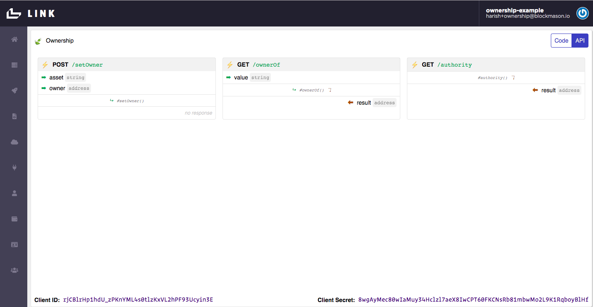

# Ownership DApp Demo using GoChain

Blockmason is excited to announce the integration of GoChain into its functions-as-a-service (FaaS) product [Link](https://mason.link). Link allows developers to use smart contracts and the power of blockchain in their web or mobile applications with *very little to no prior blockchain experience.* Link creates classic, conventional, web-based APIs for any smart contract written on a programmable blockchain such as GoChain.

[GoChain](https://gochain.io) is a scalable, high performance and low cost blockchain that supports smart contracts and distributed applications. GoChain is fully compatible with existing Ethereum wallets, smart contracts and tools and boasts significantly faster transactions (1300 tps) and lower fees (7500x cheaper) than Ethereum. 

In this activity, we will use Link to record ownership of assets (in this example, collectible digital stamps) on both GoChain and Ethereum Testnets and compare performances.

**Note:** This example builds on an earlier activity posted here: https://blockmason.link/create-a-decentralized-ownership-app-using-blockmason-link

**It is recommended that you go through it first before proceeding here.** 

A simple front-end template is provided and [Parcel](https://parceljs.org/) will be used as the web application bundler and server.

The key steps of this activity are:
1. Setup project and install dependencies
2. Fund your Link account with test GO and ETH tokens
3. Create a basic Ownership smart contract
4. Deploy the smart contract to the GoChain and Ethereum blockchains using Link
5. Configure a front-end JavaScript file
6. Run your decentralized application (DApp) on both GoChain and Ethereum

### Setup

You will need to setup the following for this activity:

> Install `Node` and `npm`: https://nodejs.org/en/download/ (note - you can also use `yarn`)

> Clone the Github repo: https://github.com/blockmason/simple-ownership-contract-demo into a new folder.

>  In the new folder, run `npm install` which will install the following key dependencies:

* `@blockmason/link-sdk` - https://www.npmjs.com/package/@blockmason/link-sdk - a simple SDK for interacting with the Link project.

* `parcel-bundler` - https://parceljs.org/getting_started.html - for bundling and running the web application

> Create a Blockmason Link account if you haven't done so already - register at https://mason.link/sign-up and then setup your demo organization.

### Fund your Link account with test GO and ETH

In the previous activity, we simply copied and pasted the Ownership smart contract code into the Link IDE and the contract was automatically deployed to the Link private blockchain without the need for acquiring any tokens to pay for gas or transaction costs. However to deploy on the GoChain or Ethereum Testnets, as we will do in this activity, we need to fund our Link account with test GO and ETH.

> Log into Link and copy your default Ethereum account as shown:


> Ask for some free testnet GO in their [Testnet Telegram](https://t.me/gochain_testnet) to be sent to your Link account (e.g. `0x3b1194ab5a1dd5b9c036424c3020b3548322219d`).

You can confirm receipt of your testnet GO by searching your Link account address in the GoChain Testnet explorer https://testnet-explorer.gochain.io/home : 


> Similarly, receive some test ETH from the Ropsten Ethereum Faucet at https://faucet.ropsten.be


You can confirm receipt of your test ETH by searching your Link account address in the Ropsten explorer https://ropsten.etherscan.io :


### Deploy the Ownership Smart Contract
The `Ownership.sol` file in the `simple-ownership-contract-demo` repo contains a very simple Ownership Smart Contract programmed using Solidity (supported by both GoChain and Ethereum):
```
pragma solidity ^0.5.8;

contract Ownership {
    mapping(string => address) public ownerOf;
    address public authority;
    
    constructor() public {
        authority = msg.sender;
    }
    
    function setOwner(string memory asset, address owner) public {
        ownerOf[asset] = owner;
    }
}
```
* Ownership is recorded in a mapping called `ownerOf` between an asset name (some string) and an Ethereum wallet address.
  
* Using the keyword `public` for the `ownerOf` mapping object automatically provides us with a getter for that object.

* The `authority` in this case will be a Link managed Ethereum address.

As mentioned, in the previous activity, we simply copied and pasted the `Ownership.sol` contract code into the Link IDE and the contract was automatically deployed to the Link private blockchain. However, deploying to public blockchains such as GoChain and Ethereum require a few more steps.

> 1. In Link, open up the setting dropdown menu and select *`New Project`* which starts the new project wizard.


> 2. Under *Which contract would you like to use?*, select *`Create new`* and then copy and paste the `Ownership.sol` code into the *`Source Code`* field. We'll set the *`Display Name`* as `Ownership`. Press *`Save`* and *`Next`*.

.

> 3. Under *Which Ethereum account would you like to use?* use the *`Default Account`*. This is the account we seeded with test GO and ETH earlier. 


> 4. Under *Which network would you like to use?* select *`Create new`* and call it `GoChain Testnet`. Keep the *Block Confirmations Needed* at 0. Press *`Save`* and *`Next`*.


> 5. Under *Which connector would you like to use?* select *`Create new`*. Call this connector `GoChain Testnet Connector` and use the URL `https://testnet-rpc.gochain.io` (see https://github.com/gochain-io/docs#network-rpc-urls for more details). Ensure the *Network* selected is *`GoChain Testnet`*. Press *`Save`* and *`Next`*.


> 6. Now we just need to label our Deployment. Under *Where is your contract deployed?*, select *`Create new`*. Call this deployment `Ownership GoChain Testnet Deployment`. Since this is **not an existing** contract deployment, leave the *Address* field blank. Ensure the *Account* is the `Default Account`, the *Contract* is the `Ownership` contract and the *Network* `GoChain Testnet`. Press *`Save`* and *`Next`*.


> 7. Now we're ready to deploy our contract to the GoChain Testnet. Press `Deploy` and you should get a deployment in progress indicator icon. This might take a few seconds to complete. If deployed correctly, you'll proceed to the next step to setup your API.


> 8. Now we label our Ownership contract API. Under *Name*, call it *`ownership-gochain-testnet`* Also add in a human-readable display name. Ensure you are using the correct *Contract Deployment*. Press *`Save`* and *`Next`*.


> 9. Now we label our Ownership API **Consumer**. This would normally be the name of the app or service calling the API. For this activity, the consumer is a `Collectible Stamps App`. Ensure you are using the correct *API* and *Account*. Press *`Save`* and *`Next`*.


> 10. Lastly, your consumer needs to authenticate with the Ownership API. A OAuth2.0 Client Secret is automatically generated. Ensure you are using the correct Principal/Consumer. Press *`Save`*, *`Next`* and then *`Finish`*.


Once you hit *`Finish`*, you should see your Ownership API documentation. Note the `client_id` and `client_secret` under *Authentication* which we will be using in our front-end app. 


 Sign into your Link account and copy and paste the  We'll call this project `Ownership`. 


> Now click on the `API` button on the `Code/API` toggle and you will see API endpoints for all the Ownership smart contract functions and attributes!



**That's it!** Our Ownership smart contract is automatically deployed to the Link private blockchain and we are ready to use our web API endpoints in our front-end DApp. 

### Configure DApp Front-End

Taking a look inside the `src/` folder, we see that it is a very basic JavaScript app with data pulled in from `stamps.json`. We also make use of jQuery and Bootstrap in our code.

> Take a look at `index.html` and `js/app.js` code templates, which is where we will focus our efforts.

#### index.html
We see that the html template loads each of the stamps with data from `stamps.json` including an image, and an input field for setting an owners address. When a user presses the `Own` button, the intent is for the user-specified address to be recorded as the stamp's owner.

#### app.js
The template code has been provided and we just need to fill in the details.
```
const stampData = require('../stamps.json');
const { link } = require('@blockmason/link-sdk');

const ownershipProject = link({
    clientId: '',
    clientSecret: ''
});
```
We import the stamp data and the `@blockmason/link-sdk` package. We then need to provide the `clientId` and `clientSecret` from Link in order to use the `.get` and `.post` methods provided by the `link` object. 

> Copy and paste your specific `clientId` and `clientSecret` from the bottom of the Link IDE screen:


```
App = {
    init: function() {
        // Load stamps.
        const stampsRow = $('#stampsRow');
        const stampTemplate = $('#stampTemplate');
    
        for (i = 0; i < stampData.length; i ++) {
            stampTemplate.find('.panel-title').text(stampData[i].name);
            stampTemplate.find('img').attr('src', stampData[i].picture);
            stampTemplate.find('.stamp-location').text(stampData[i].location);
            stampTemplate.find('.btn-own').attr('data-id', stampData[i].id);
    
            stampsRow.append(stampTemplate.html());
            App.markOwned(i, stampData[i].id);
        }
        return App.bindEvents();
    },

    bindEvents: function() {
        $(document).on('click', '.btn-own', App.setOwnership);
    },

```
The above code:
* Loads all the stamp data as part of our `stampTemplate` into our `stampRow` element.

* Calls `App.markOwned(..)` which will check the blockchain for ownership records and mark an asset with its corresponding owner on the front-end.

* Returns a button 'click' event listener

```
markOwned: async function(index, name) {
    // Mark stamp ownership
},
```
Here, we will call the `GET /ownerOf` API endpoint to retrive the owner of an asset value we pass. 


Note the following:
* We pass an attribute called `value` which is a string
* We get a response object called `result` which is an address

The `index` function argument is used to identify which `.panel-stamp` element is being referenced during the for loop in `App.init()`. Our completed code looks like the following:
```
markOwned: async function(index, name) {
    const asset = {
        "value": name
    };  

    const { result } = await ownershipProject.get('/ownerOf', asset);
    
    if (result !== '0x0000000000000000000000000000000000000000') {
        $('.panel-stamp').eq(index).find('#ownerAddress').empty();
        $('.panel-stamp').eq(index).find('#ownerAddress').append('Owner: ' + result).css({ wordWrap: "break-word" });
    }
},
```
Lastly, we need to complete the `setOwnership` function:
```
setOwnership: async function(event) {
    event.preventDefault();
    if (confirm("Confirm ownership of this stamp, which can take a few seconds to record on the blockchain")) {
        const stampId = $(event.target).data('id');
        const owner = $(event.target).closest("div.owner-address").find("input[name='owner']").val();
        $(event.target).text("Processing").attr('disabled', true);

    // Set Ownership code
    }
}
```
Here, we will call the `POST /setOwner` API endpoint to set the owner of an asset with an address.


Note the following:
* We pass an attribute called `asset` which is a string, and `owner` which is an address.
* We don't get a response object

That last point is true if the POST request is successful. Otherwise, an `error` object is returned containing the error details. Our completed code looks like the following:
```
setOwnership: async function(event) {
    event.preventDefault();
    if (confirm("Confirm ownership of this stamp, which can take a few seconds to record on the blockchain")) {
        const stampId = $(event.target).data('id');
        const owner = $(event.target).closest("div.owner-address").find("input[name='owner']").val();
        $(event.target).text("Processing").attr('disabled', true);

        const reqBody = {
            "asset": stampId,
            "owner": owner
        };

        const response = await ownershipProject.post('/setOwner', reqBody);
        
        if(response.errors) {
            alert(response.errors[0].detail);
            $(event.target).text("Own").attr('disabled', false);
        } 
        else {
            console.log('Post request successful');
            $(event.target).text("Own").attr('disabled', false);
            $(event.target).closest("div.owner-address").find("input[name='owner']").val('');  
            $(event.target).parents(".panel-stamp").find("#ownerAddress").text('Owner: ' + owner);
        }
    }
}
```
Find the complete code in `app-complete.js`. 

Note - we didn't use any complex or large libraries like `web3.js`, which requires an instance of the `Ownership` contract to be created before the contract function methods can be called. **Except for our confirm message, there is nothing in the code to even indicate that blockchains are involved!**

### Run your DApp

> Run the application from the project root folder with:
```
npm start
```

See the full command this executes under `scripts` in `package.json`. 

Note the following:
* By default, the DApp will run at https://localhost:1234 . You can specify the `-p` flag in the scripts command in `package.json` if you want to use a specific port.

* `Parcel` will create the following folders in your project folder: `.cache/` and `dist/`. If you run into any errors while running your DApp, delete these folders and run `npm start` again.

Copy and paste in an Ethereum wallet address (for example `0xca14563Ce2585B6026b7691f264ac2173CdEC530`) and try to own one of the Collectible Stamps. *Note:* if you do not enter in a valid address, you will see the following error alert pop up:


When running, your DApp should look similar to the following:


**Congrats** on getting your first DApp running from scratch using Link!

---

Throughout this example, we touched on Link concepts including deploying a smart contract, using the Link IDE, using Link API endpoints, and more.

To learn more about Blockmason Link, check out the official Link website at [blockmason.link](blockmason.link) or our weekly blog posts at [blockmason.link/blog](blockmason.link/blog).

## You can also connect with the Blockmason Link Team on these social channels:

-    Twitter: [https://twitter.com/BlockmasonLink](https://twitter.com/BlockmasonLink)
-    Telegram: [https://t.me/blockmasonlink](https://t.me/blockmasonlink)
-    Reddit: [https://www.reddit.com/r/blockmason/](https://www.reddit.com/r/blockmason/)
